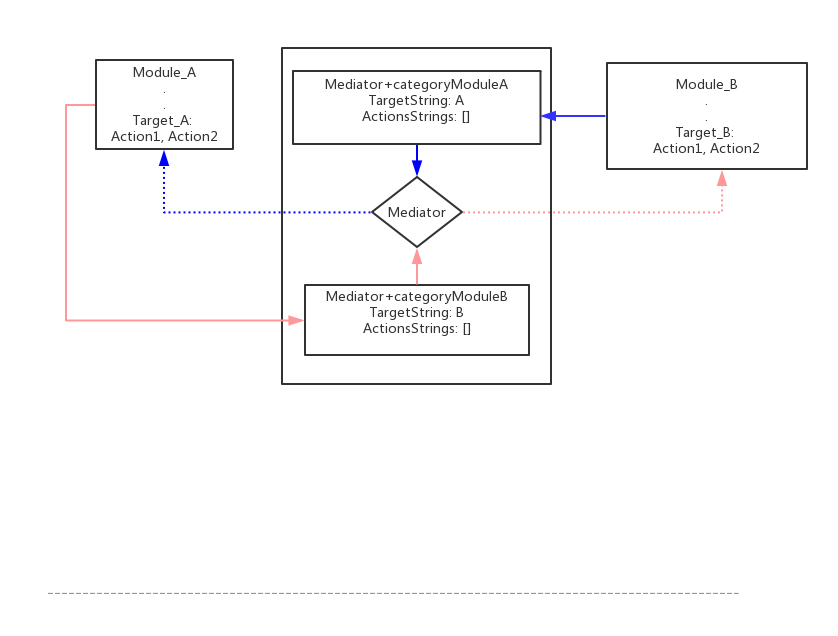
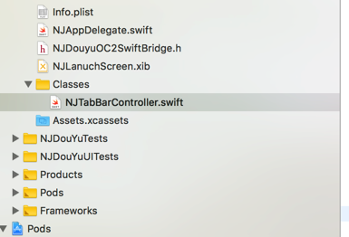

# SwiftProject
> **最彻底的组件化**
> 正在进行中, 逐渐完善文档和项目
> 组件仓库: https://github.com/NJHu/NJSpecs.git

## 模块交互
> **实线表示依赖和调用, 虚线表示动态调用**



## 模块划分
> 一切皆组件, 组件皆一切

- 1, 主工程只需要拥有 NJAppDelegate 和 NJTabBarController. 
- 2, 其他所有的功能都在相应的组件里边

- 

### NJTabBarController

``` swift
// MARK: - 添加模块
extension NJTabBarController {
    private func addChildVcs() -> Void {
        let nav0 = NJMediator.sharedMediator.Mediator_DYLiveShow_MainController()
        if nav0 != nil {
            self.addChildViewController(nav0!)
        }
        let nav1 = NJMediator.sharedMediator.Mediator_DYTrends_MainController()
        if nav1 != nil {
            self.addChildViewController(nav1!)
        }
    }
}
```


